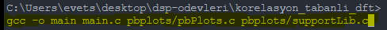
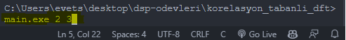

### correlation-based-DFT
Discrete Fourier Transform of a discrete sinus signal

## Usage

# Compile

# Run

The first argument is the frequency (Hz) of the sine wave we want to create, and the second argument is how many seconds the sine wave will last.
